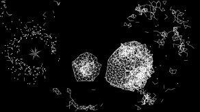
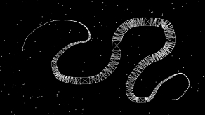
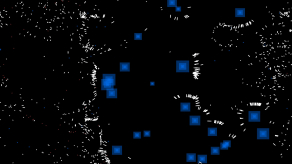
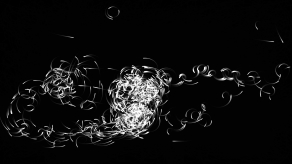
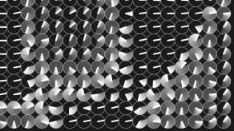

# Sessions 2D

 

This project consists of individual sessions of 2d canvas programming, with the goal of creating some kind of output. The code itself is licensed under MIT, but the designs of the individual sessions are released under Creative Commons Attribution Non-Commercial license. This means you can re-use the components of the code as you see fit, but if you copy and paste an entire session, please observe the Creative Commons license. File an issue for consideration if you would like to use these designs for commercial uses, or if you have any questions about usage.

